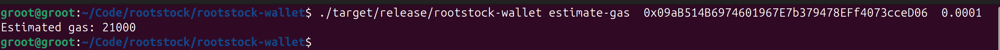
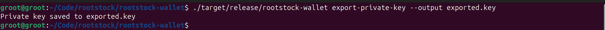
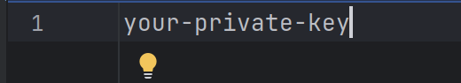
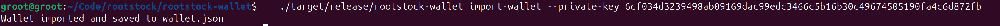
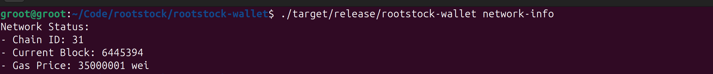
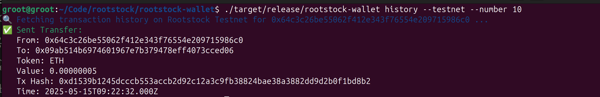
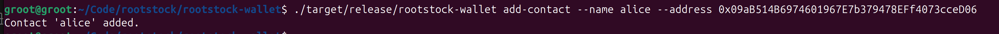
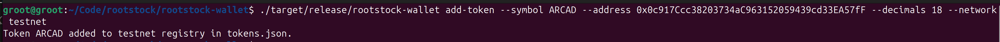
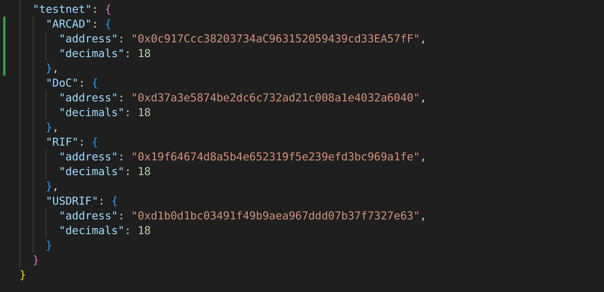
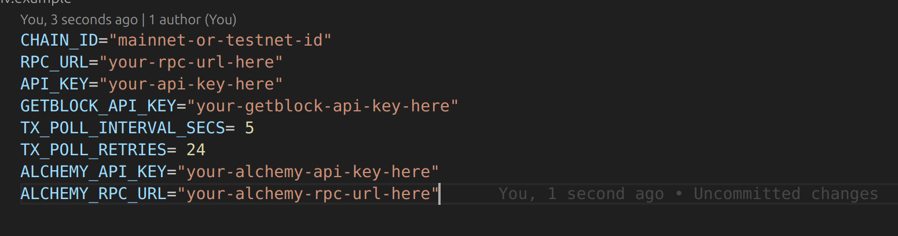

# Rootstock Wallet CLI

A lightweight Rust-based CLI application for managing Rootstock wallets, transferring RBTC, estimating gas, and interacting with the Rootstock blockchain. Designed for developers building on the Rootstock ecosystem.

## Features

- **Wallet Management**:
  - Generate new wallets.
  - Load and save wallets securely.
  - Import wallets from mnemonic phrases or private keys.
  - Export private keys.
  - Export wallets in JSON keystore format.
- **RBTC Transfers**:
  - Send RBTC to any Rootstock address.
  - Locally sign transactions for enhanced security.
- **Balance Retrieval**:
  - ✔️ Fetch and display the RBTC balance of any address.
- **Gas Estimation**:
  - Estimate gas costs for transactions.
- **Network Information**:
  - Retrieve current block number, gas price, and chain ID.
- **QR Code Generation**:
  - ✔️ Generate QR codes for wallet addresses.
- **Multi-Signature Wallet Support**:
  - Create multi-signature wallets with specified owners and required approvals.
  - Propose transactions requiring multiple approvals.
  - Approve proposed transactions.
- **Network Configuration**:
  - Support for both mainnet and testnet
  - Network selection via command-line flag
  - ✔️ Automatic chain ID configuration
- **Transaction History**:
  - View transaction history for any address
  - Display both RBTC and ERC-20 token transfers
  - Limit the number of transactions shown
- **Token Management**:
  - Check balances for ERC-20 tokens
  - Support for RIF, USDRIF, and custom tokens
  - Token registry for easy symbol-to-address mapping

## Installation

Clone the repository and build the project using Cargo:

```bash
cd rootstock-wallet
cargo build --release
```

## Usage

Run the CLI application:

```bash
cargo run
```

### Commands

1. **Transfer RBTC**:
   Send RBTC to a recipient address.

   ```bash
   cargo run transfer --recipient <ADDRESS> --amount <AMOUNT> --network <mainnet|testnet>
   ```

   Example:

   ```bash
   cargo run transfer --recipient 0x09aB514B6974601967E7b379478EFf4073cceD06 --amount 0.0001 --network testnet
   ```

2. **Get Balance**:
   Fetch the RBTC balance of an address.

   ```bash
   cargo run get-balance --address <ADDRESS> --network <mainnet|testnet>
   ```

   Example:

   ```bash
   cargo run get-balance --address 0x09aB514B6974601967E7b379478EFf4073cceD06 --network testnet
   ```

3. **Show Wallet**:
   Display the wallet's address and public key.

   ```bash
   cargo run show-wallet --network <mainnet|testnet>
   ```

   Example:

   ```bash
   cargo run show-wallet --network testnet
   ```

4. **Token Balance**:
   Check the balance of an ERC-20 token.

   ```bash
   cargo run token-balance --address <ADDRESS> --token <TOKEN_SYMBOL> --network <mainnet|testnet>
   ```

   Example:

   ```bash
   cargo run token-balance --address 0x09aB514B6974601967E7b379478EFf4073cceD06 --token RIF --network testnet
   ```

5. **Transaction History**:
   View transaction history for an address.

   ```bash
   cargo run history --address <ADDRESS> --limit <NUMBER> --network <mainnet|testnet>
   ```

   Example:

   ```bash
   cargo run history --address 0x09aB514B6974601967E7b379478EFf4073cceD06 --limit 5 --network testnet
   ```

6. **Contact Management**:
   Manage contacts for easier address management.

   ```bash
   # Add a contact
   cargo run contact --action add --name alice --address 0x09aB514B6974601967E7b379478EFf4073cceD06

   # List all contacts
   cargo run contact --action list

   # Show a specific contact
   cargo run contact --action show --name alice

   # Delete a contact
   cargo run contact --action delete --name alice
   ```

   Example:

   ```bash
   cargo run contact --action add --name alice --address 0x09aB514B6974601967E7b379478EFf4073cceD06
   ```

   

8. **Network Configuration**:
   All commands support network selection:

   ```bash
   cargo run <command> --network <mainnet|testnet>
   ```

   Example:

   ```bash
   cargo run transfer --network mainnet --recipient 0x09aB514B6974601967E7b379478EFf4073cceD06 --amount 0.0001
   ```

9. **Estimate Gas**:
   Estimate gas costs for a transaction.

   ```bash
   cargo run estimate-gas  <ADDRESS>  <AMOUNT> --network <mainnet|testnet>
   ```
   Example:

   

10. **Export Private Key**:
   Export the wallet's private key to a file.

   ```bash
   cargo run export-private-key --output <FILENAME>
   ```

   Example:

   ```bash
   cargo run export-private-key --output private.key
   ```
   

   This will generate a file with the private key.

   

11. **Import Wallet**:
   Import a wallet from a mnemonic phrase or private key.

   ```bash
   cargo run import-wallet --mnemonic <MNEMONIC> --private-key <PRIVATE_KEY>
   ```

   Example (using a mnemonic):

   ```bash
   cargo run import-wallet --mnemonic "abandon abandon abandon abandon abandon abandon abandon abandon abandon abandon abandon about"
   ```

   Example (using a private key):

   

12. **Export Keystore**:
   Export the wallet in JSON keystore format.

   ```bash
   cargo run export-keystore --password <PASSWORD> --output <FILENAME>
   ```

   Example:

   ```bash
   cargo run export-keystore --password mypassword --output keystore.json
   ```

13. **View Transaction History**:
   Display transaction history for an address.

   ```bash
   cargo run history --address <ADDRESS> --limit <NUMBER> --network <mainnet|testnet>
   ```

   Example:
   ```bash
   cargo run history --address 0x09aB514B6974601967E7b379478EFf4073cceD06 --limit 5 --network testnet
   ```

14. **Check Token Balance**:
   View the balance of an ERC-20 token for an address.

   ```bash
   cargo run token-balance --address <ADDRESS> --token <TOKEN_SYMBOL> --network <mainnet|testnet>
   ```

   Example:
   ```bash
   cargo run token-balance --address 0x09aB514B6974601967E7b379478EFf4073cceD06 --token RIF --network testnet
   ```

15. **Network Info**:
    Display current network information (block number, gas price, chain ID).

   ```bash
    cargo run network-info --network <mainnet|testnet>
   ```

   

16. **Transfer ERC-20 Tokens**:
    Transfer tokens like RIF, DOC, SOV, or rUSDT.

    ```bash
    cargo run transfer-token --token-address <TOKEN_ADDRESS> --recipient <RECIPIENT_ADDRESS> --amount <AMOUNT> --network <mainnet|testnet>
    ```

    Example:

    ```bash
    cargo run transfer-token --token-address 0xTokenContractAddress --recipient 0xRecipientAddress --amount 10 --network testnet
    ```
    
17. **Transaction History**:
   Retrieve the transaction history for your own address or any specified address.

   ```bash
   cargo run transaction-history --address <ADDRESS> --network <mainnet|testnet>
   ```

   Example:

   

   This will fetch the last 10 transactions for the current wallet address on testnet.

18. **Contact Management**:
   Easily save, list, and use contacts for transactions.

   - **Add a Contact**:

   ```bash
     cargo run add-contact --name <NAME> --address <ADDRESS>
   ```

   Example:

   

   - **List Contacts**:

   ```bash
   cargo run list-contacts
   ```

   Example:

   

   - **Show Contact Details**:

   ```bash
     cargo run show-contact --name <NAME>
   ```

   Example:

   

   - **Transfer to a Contact**:
   You can use a contact's name instead of an address in transfer commands:

   ```bash
     cargo run transfer --recipient <CONTACT_NAME> --amount <AMOUNT>
   ```

   Example:

   ```bash
     cargo run transfer --recipient alice --amount 0.01
   ```

19. **Add Token to Registry**:
   Add new tokens to the registry by adding them to the `tokens.json` file in the `src` directory.

   ```bash
   cargo run add-token --symbol ARCAD --address 0x0c917Ccc38203734aC963152059439cd33EA57fF --decimals 18 --network testnet
   ```

   Example:

   

   This command adds a new token to the registry, allowing you to transfer it using the symbol `ARCAD`.

   

## Configuration

The application connects to the Rootstock network using the public JSON-RPC endpoint:

- **Mainnet**: `https://public-node.rsk.co`
- **Testnet**: `https://public-node.testnet.rsk.co`

Additionally, the `.env` file includes the following configurations:



Ensure these variables are properly set in your environment file before running the application.

You can modify the provider URL in the env files file if needed.

## Contribution

Contributions are welcome! Please follow these steps:

1. Fork the repository.
2. Create a new branch for your feature or bug fix.
3. Submit a pull request with a detailed description of your changes.

## License

This project is licensed under the MIT License. See the [LICENSE](LICENSE) file for details.

## Acknowledgments

This project was developed as part of the Rootstock Hacktivator program to contribute to the Rootstock ecosystem. Special thanks to the Rootstock team for their support and resources.